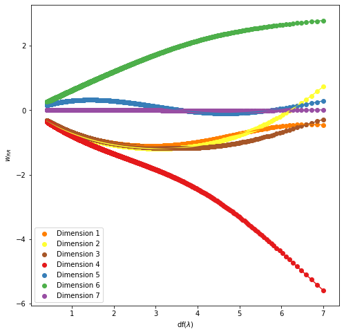
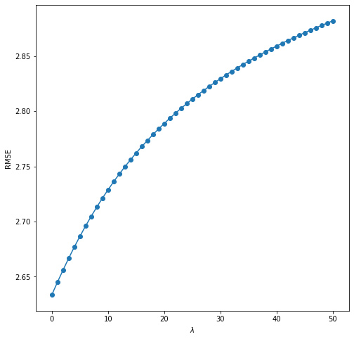
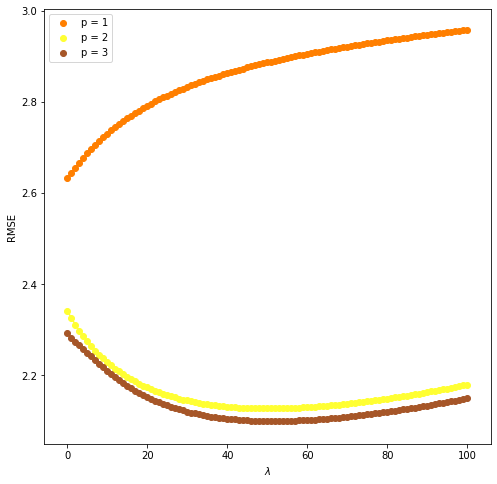

# Ridge Regression
This scenario analyzes data using the ridge regression techniques. The goal of the problem is to **predict the miles per gallon a car will get** using six quantities (features) about that car. The data is broken into training and testing sets. Each row in both “$X$” files contain six features for a single car (plus a 1 in the 7th dimension) and the same row in the corresponding “$y$” file contains the miles per gallon for that car.

---
## Problem 1:
>1. Given the ridge regression problem $\mathcal{L} = \lambda \|w\|^2 + \sum^{350}_{i=1} \|y_i - x^T_i W\|^2$, for $\lambda = 0,1,2,...,5000$, solve for $w_{\rm RR}$. (Notice that when $\lambda = 0$, $w_{\rm RR} = w_{\rm LS}$.) In one figure, plot the 7 values in $w_{\rm RR}$ as a function of $df(\lambda)$. 7 curves are labeled by their dimension in $x$.

After taking the gradient of $\mathcal{L}$ and set it to zero, we have
\begin{equation}
    w_{\rm RR} = (\lambda I + X^T X)^{-1}X^Ty
\end{equation}

And we could calculate Degree of Freedom as
\begin{equation}
    df(\lambda) = {\rm trace}[X(X^TX+\lambda I)^{-1}X^T]
\end{equation}

For $\lambda = 0,1,2,...,5000$, solved $w_{\rm RR}$ with the 7 feature values as a function of $df(\lambda)$ can be showed as the following figure:

||
|:--:|
|Relationship between $w_{\rm RR}$ and $df(\lambda)$ with varying dimensions|

---

> 2. Two dimensions clearly stand out over the others. Which ones are they and what information can we get from this?

From the solution figure above, we know that the fourth dimension (weight) and the sixth dimension (year made) have the highest solved value, which indicates that they are the most important features in determining the fuel efficiency for cars. As the sixth dimension is positive, it shows that the fuel efficiency increases with the increase in car years. As the fourth dimension is negative, it shows that the fuel efficiency decreases with the increase in car weight.

Also, we know that when the $df(\lambda)$ is the maximum value, that corresponds to $\lambda$ equal to 0, which is the least squares solution. Therefore, we can say that for the least squares solution, the fourth dimension (weight) and the sixth dimension (year made) are the most important dimensions which affect the solution, but because we always try and regularize the weights to be small, their weights get penalized the most by including the hyper parameter ($\lambda$) for ridge regression and varying it.

As $\lambda$ is always greater than 0, increasing the values of $\lambda$ leads to a decrease in the degrees of freedom and regularized weights for all the covariates in our solution.

---

> 3. For $\lambda = 0,1,2,...,50$, predict all 42 test cases. Plot the root mean squared error (RMSE) on the test set as a function of $\lambda$ -- not as a function of $df(\lambda)$. What does this figure tell you when choosing $\lambda$ for this problem (and when choosing between ridge regression and least squares)?

||
|:--:|
|Relationship between RMSE and $\lambda$|

From the figure above, we can understand that the least RMSE value is obtained for $\lambda = 0$ and with the value of $\lambda$ increases, the RMSE increases. Also, as $\lambda = 0$ is the least squares solution, which gives the least RMSE value, for this particular problem, using just the polynomial order 1 covariates, we should use the least squares solution (where $\lambda = 0$) instead of using ridge regression (where $\lambda > 0$).

---
## Problem 2:
> 1. Modify the code to learn a $p$ th-order polynomial regression model for $p=1,2,3$. (You’ve already done $p=1$ above.) In one figure, plot the test RMSE as a function of $\lambda = 0,1,2,...,100$ for $p=1,2,3$. Base on this plot, which value of $p$ should you choose and why? How does your assessment of the ideal value of $\lambda$ change for this problem?

||
|:--:|
|Relationship between RMSE and $\lambda$ with varying polynomial orders|

From the figure above (*with the standardization pre-processing for the data, and get rid of the offset dimension in original X data, the 7th dimension*), we should choose the polynomial order $p = 3$, as it results in the lowest RMSE value 2.0999 for a particular value of $\lambda$ at 52. Also at $p = 2$, we get nearly the same lowest RMSE value 2.1275 at $\lambda = 50$.

We can say that when $p = 1$, it produces a simpler model that underfits the data compared to higher polnomial regression models, and when $\lambda=0$, the RMSE value meets the minimum, which is the least squares solution. However, the RMSE value for $p = 1$ is always larger than $p = 2$ and $p = 3$. It shows that higher polnomial regression models fit better for this problem.
